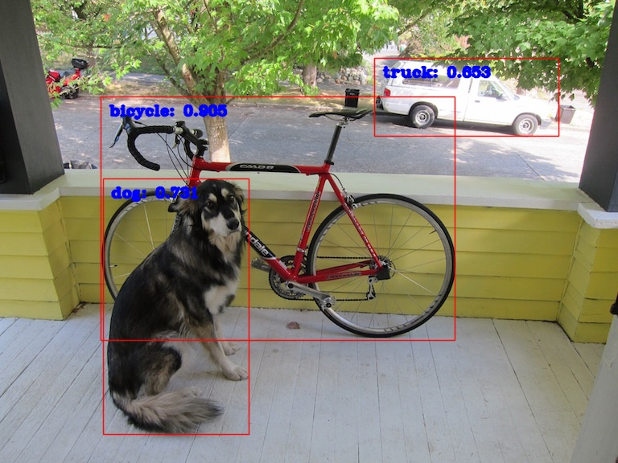

# 目标检测 demo 使用指南

- [快速开始](#快速开始)
  - [环境准备](#环境准备)
  - [部署步骤](#部署步骤)
- [代码介绍](#代码介绍)
- [进阶使用](#进阶使用)
  - [更新预测库](#更新预测库) 
  - [更新模型、输入和输出预处理](#更新模型输入和输出预处理)
    - [更新模型](#更新模型)
    - [更新输入/输出预处理](#更新输入输出预处理)

本指南主要介绍 PaddleX 端侧部署——目标检测 demo 在 Android shell 上的运行方法。
本指南适配了 2 个目标检测模型和 1 个版面分析模型：
- PicoDet-S（cpu & gpu）
- PicoDet-L（cpu & gpu）
- PicoDet_layout_1x（cpu & gpu）

## 快速开始

### 环境准备

1. 在本地环境安装好 CMAKE 编译工具，并在 [Android NDK 官网](https://developer.android.google.cn/ndk/downloads)下载当前系统的某个版本的 NDK 软件包。例如，在 Mac 上开发，需要在 Android NDK 官网下载 Mac 平台的 NDK 软件包

    **环境要求**
    -  `CMake >= 3.10`（最低版本未经验证，推荐 3.20 及以上）
    -  `Android NDK >= r17c`（最低版本未经验证，推荐 r20b 及以上）

    **本指南所使用的测试环境：**
    -  `cmake == 3.20.0`
    -  `android-ndk == r20b`

2. 准备一部 Android 手机，并开启 USB 调试模式。开启方法: `手机设置 -> 查找开发者选项 -> 打开开发者选项和 USB 调试模式`

3. 电脑上安装 ADB 工具，用于调试。ADB 安装方式如下：

    3.1. Mac 电脑安装 ADB:

    ```shell
    brew cask install android-platform-tools
    ```

    3.2. Linux 安装 ADB

    ```shell
    sudo apt update
    sudo apt install -y wget adb
    ```

    3.3. Windows 安装 ADB

    win 上安装需要去谷歌的安卓平台下载 ADB 软件包进行安装：[链接](https://developer.android.com/studio)

    打开终端，手机连接电脑，在终端中输入

    ```shell
    adb devices
    ```

    如果有 device 输出，则表示安装成功。

    ```shell
    List of devices attached
    744be294    device
    ```

### 部署步骤

克隆 `Paddle-Lite-Demo` 仓库的 `feature/paddle-x` 分支到 `PaddleX-Lite-Deploy` 目录。

```
git clone -b feature/paddle-x https://github.com/PaddlePaddle/Paddle-Lite-Demo.git PaddleX_Lite_Deploy
```

1. 将工作目录切换到 `PaddleX-Lite-Deploy/libs` 目录，运行 `download.sh` 脚本，下载需要的 Paddle Lite 预测库。此步骤只需执行一次，即可支持每个 demo 使用。

2. 将工作目录切换到 `PaddleX-Lite-Deploy/object_detection/assets` 目录，运行 `download.sh` 脚本，下载 [paddle_lite_opt 工具](https://www.paddlepaddle.org.cn/lite/v2.10/user_guides/model_optimize_tool.html) 优化后的模型文件。

3. 将工作目录切换到 `PaddleX-Lite-Deploy/object_detection/android/shell/cxx/picodet_detection` 目录，运行 `build.sh` 脚本，完成可执行文件的编译。

4. 将工作目录切换到 `PaddleX-Lite-Deploy/object_detection/android/shell/cxx/picodet_detection`，运行 `run.sh` 脚本，完成在端侧的预测。

**注意事项：**
  - 在运行 `build.sh` 脚本前，需要更改 `NDK_ROOT` 指定的路径为实际安装的 NDK 路径。
  - 若在 Mac 系统上编译，需要将 `CMakeLists.txt` 中的 `CMAKE_SYSTEM_NAME` 设置为 `darwin`。
  - 在运行 `run.sh` 脚本时需保持 ADB 连接。
  - `download.sh` 和 `run.sh` 支持传入参数来指定模型，若不指定则默认使用 `PicoDet-S` 模型。目前适配了 3 个模型： 
    - `PicoDet-S`、`PicoDet-S_gpu`
    - `PicoDet-L`、`PicoDet-L_gpu`
    - `PicoDet_layout_1x`、`PicoDet_layout_1x_gpu`

以下为实际操作时的示例：
```shell
 # 1. 下载需要的 Paddle Lite 预测库
 cd PaddleX-Lite-Deploy/libs
 sh download.sh

 # 2. 下载 paddle_lite_opt 工具优化后的模型文件
 cd ../object_detection/assets
 sh download.sh PicoDet-S

 # 3. 完成可执行文件的编译
 cd ../android/shell/cxx/picodet_detection
 sh build.sh

# 4. 预测
 sh run.sh PicoDet-S
```

运行结果如下所示：

```text
======= benchmark summary =======
input_shape(s) (NCHW): {1, 3, 320, 320}
model_dir:./models/PicoDet-S/model.nb
warmup:1
repeats:10
power_mode:1
thread_num:0
*** time info(ms) ***
1st_duration:313.334
max_duration:277.811
min_duration:271.605
avg_duration:274.179

====== output summary ====== 
detection, image size: 768, 576, detect object: bicycle, score: 0.905929, location: x=125, y=120, width=441, height=304
detection, image size: 768, 576, detect object: truck, score: 0.653791, location: x=465, y=72, width=230, height=98
detection, image size: 768, 576, detect object: dog, score: 0.731587, location: x=128, y=222, width=182, height=319
``` 



## 代码介绍

```
.
├── ...
├── object_detection 
│    ├── ...
│    ├── android
│    │    ├── ...
│    │    └── shell
│    │        └── cxx
│    │            └── picodet_detection
│    │                ├── CMakeLists.txt # CMake 文件，约束可执行文件的编译方法
│    │                ├── README.md
│    │                ├── build.sh # 用于可执行文件的编译
│    │                ├── picodet_detection.cc # 目标检测的预测代码
│    │                └── run.sh # 用于预测
│    └── assets # 存放模型、测试图片、标签文件
│        ├── images
│        ├── labels
│        ├── models
│        └── download.sh # 下载脚本，用于下载 paddle_lite_opt 工具优化后的模型
└── libs # 存放不同端的预测库和 OpenCV 库。
    ├── ...
    └── download.sh # 下载脚本，用于下载 Paddle Lite 预测库和 OpenCV 库
```

```shell
# picodet_detection.cc 预测代码中各函数功能介绍
pre_process(...) : 完成目标检测的预处理功能
post_process(...) : 完成目标检测的后处理功能
run_model(...) : 完成目标检测的预测全流程功能
load_labels(...) : 完成标签文件读取功能
neon_mean_scale(...): 完成图像数据赋值给Tensor的加速处理功能
```

```shell
# run.sh 脚本中可执行文件的参数含义：
 adb shell "cd ${ADB_DIR} \
           && chmod +x ./picodet_detection \
           && export LD_LIBRARY_PATH=${ADB_DIR}:${LD_LIBRARY_PATH} \
           &&  ./picodet_detection \
               \"./models/${MODEL_NAME}/model.nb\" \
               ./images/dog.jpg \
               ./labels/coco_label_list.txt \
               0.5 320 320 \
               0 1 10 1  \
           "

 第一个参数：picodet_detection 可执行文件，属于必选项
 第二个参数：./models/${MODEL_NAME}/model.nb 优化后的模型文件，属于必选项
 第三个参数：./images/tabby_cat.jpg  测试图片，属于必选项
 第四个参数：./labels/coco_label_list.txt  label 文件，属于必选项
 第五个参数：0.5 thresh 域值大小，属于可选项，默认是 0.5
 第六个参数：320 输入图片宽度，属于可选项，默认是 320
 第七个参数：320 输入图片高度，属于可选项，默认是 320
 第八个参数：0 是否绑核，0-绑定大核， 1-绑定小核，2-绑定所有核，3-不绑核，属于可选项，默认是 0
 第九个参数：1 线程数，属于可选项，默认是 1
 第十个参数：10 repeats 数目，属于可选项，默认是 1
 第十一个参数：1 warmup 数目，属于可选项，默认是 0
```

## 进阶使用

如果快速开始部分无法满足你的需求，可以参考本节对 demo 进行自定义修改。
本节主要包含两部分： 更新预测库，更新模型、输入和输出预处理。

### 更新预测库

本指南所使用的预测库为最新版本（214rc），若需使用其他版本，可参考如下步骤：

* Paddle Lite 项目：https://github.com/PaddlePaddle/Paddle-Lite
  * 参考 [Paddle Lite 源码编译文档](https://www.paddlepaddle.org.cn/lite/develop/source_compile/compile_env.html)，编译 Android 预测库
  * 编译最终产物位于 `build.lite.xxx.xxx.xxx` 下的 `inference_lite_lib.xxx.xxx`
    * 替换 c++ 库
        * 头文件
          将生成的 `build.lite.android.xxx.gcc/inference_lite_lib.android.xxx/cxx/include` 文件夹替换 demo 中的 `PaddleX-Lite-Deploy/libs/android/cxx/include`
        * armeabi-v7a
          将生成的 `build.lite.android.armv7.gcc/inference_lite_lib.android.armv7/cxx/libs/libpaddle_lite_api_shared.so` 库替换 demo 中的 `PaddleX-Lite-Deploy/libs/android/cxx/libs/armeabi-v7a/libpaddle_lite_api_shared.so`
        * arm64-v8a
          将生成的 `build.lite.android.armv8.gcc/inference_lite_lib.android.armv8/cxx/libs/libpaddle_lite_api_shared.so` 库替换 demo 中的 `PaddleX-Lite-Deploy/libs/android/cxx/libs/arm64-v8a/libpaddle_lite_api_shared.so`

### 更新模型、输入和输出预处理

#### 更新模型

本指南只对 `PicoDet-S`、`PicoDet-L`、`PicoDet_layout_1x` 模型进行了验证，其他模型不保证适用性。
本节以更新 `PicoDet-L` 模型为例，其他模型可参考以下步骤：

1. 将优化后的 `PicoDet-L` 模型存放到目录 `PaddleX-Lite-Deploy/object_detection/assets/models/` 下，最终得到的文件结构如下：

```text
.
├── object_detection 
│    ├── ...
│    └── assets 
│        ├── models
│        │   ├── ...
│        │   └── PicoDet-L
│        │       └── model.nb 
│        └── ...
└── ...
```

2. 将模型目录名加入到 `run.sh` 脚本中的 `MODEL_LIST`。

```shell
MODEL_LIST="PicoDet-S PicoDet-L" # 模型之间以单个空格为间隔
```

3. 运行 `run.sh` 脚本时使用模型目录名。

```shell
sh run.sh PicoDet-L
```

**注意：**
-  如果更新模型的输入/输出 Tensor 个数、shape 和 Dtype 发生更新，需要更新文件 `PaddleX-Lite-Deploy/object_detection/android/shell/cxx/picodet_detection/picodet_detection.cc` 的 `pre_process` 预处理和 `pre_process` 后处理代码即可。

- 如果需要更新 `labels.txt` 标签文件，则需要将新的标签文件存放在目录 `PaddleX-Lite-Deploy/object_detection/assets/labels/` 下，并更新 `PaddleX-Lite-Deploy/object_detection/android/shell/cxx/picodet_detection/run.sh` 脚本。

```shell
# path: PaddleX-Lite-Deploy/object_detection/android/shell/cxx/picodet_detection/run.sh
# old
adb shell "cd ${ADB_DIR} \
           && chmod +x ./picodet_detection \
           && export LD_LIBRARY_PATH=${ADB_DIR}:${LD_LIBRARY_PATH} \
           &&  ./picodet_detection \
              \"./models/${MODEL_NAME}/model.nb\" \
               ./images/dog.jpg \
               ./labels/coco_label_list.txt \
               0.5 320 320 \
               0 1 100 5  \
          "
# now
adb shell "cd ${ADB_DIR} \
           && chmod +x ./picodet_detection \
           && export LD_LIBRARY_PATH=${ADB_DIR}:${LD_LIBRARY_PATH} \
           &&  ./picodet_detection \
               \"./models/${MODEL_NAME}/model.nb\" \
               ./images/dog.jpg \
               ./labels/new_label.txt \
               0.5 320 320 \
               0 1 100 5  \
          "
```

#### 更新输入/输出预处理
1. 更新输入数据

- 将更新的图片存放在 `PaddleX-Lite-Deploy/object_detection/assets/images/` 下；
- 更新文件 `PaddleX-Lite-Deploy/object_detection/android/shell/cxx/picodet_detection/run.sh` 脚本

以更新 `cat.jpg` 为例，则先将 `cat.jpg` 存放在 `PaddleX-Lite-Deploy/picodet_detection/assets/images/` 下，然后更新脚本

```shell
# path: PaddleX-Lite-Deploy/object_detection/android/shell/cxx/picodet_detection/run.sh
# old
"cd ${ADB_DIR} \
           && chmod +x ./picodet_detection \
           && export LD_LIBRARY_PATH=${ADB_DIR}:${LD_LIBRARY_PATH} \
           &&  ./picodet_detection \
               \"./models/${MODEL_NAME}/model.nb\" \
               ./images/dog.jpg \
               ./labels/coco_label_list.txt \
               0.5 320 320 \
               0 1 100 5  \
          "
# now
"cd ${ADB_DIR} \
           && chmod +x ./picodet_detection \
           && export LD_LIBRARY_PATH=${ADB_DIR}:${LD_LIBRARY_PATH} \
           &&  ./picodet_detection \
               \"./models/${MODEL_NAME}/model.nb\" \
               ./images/cat.jpg \
               ./labels/coco_label_list.txt \
               0.5 320 320 \
               0 1 100 5  \
          "
```


2. 更新输入预处理
此处需要更新 `PaddleX-Lite-Deploy/object_detection/android/shell/cxx/picodet_detection/picodet_detection.cc` 的 `pre_process` 预处理实现。

3. 更新输出预处理
此处需要更新 `PaddleX-Lite-Deploy/object_detection/android/shell/cxx/picodet_detection/picodet_detection.cc` 的 `post_process` 后处理代码实现。
